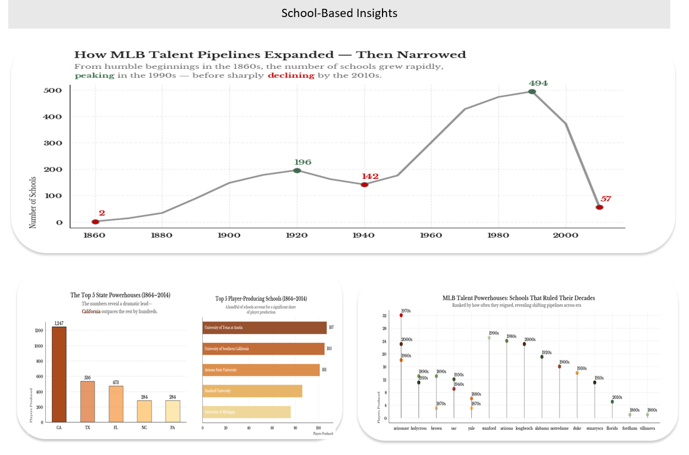
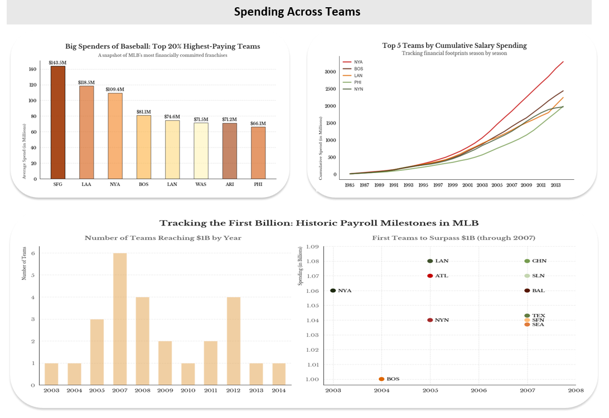
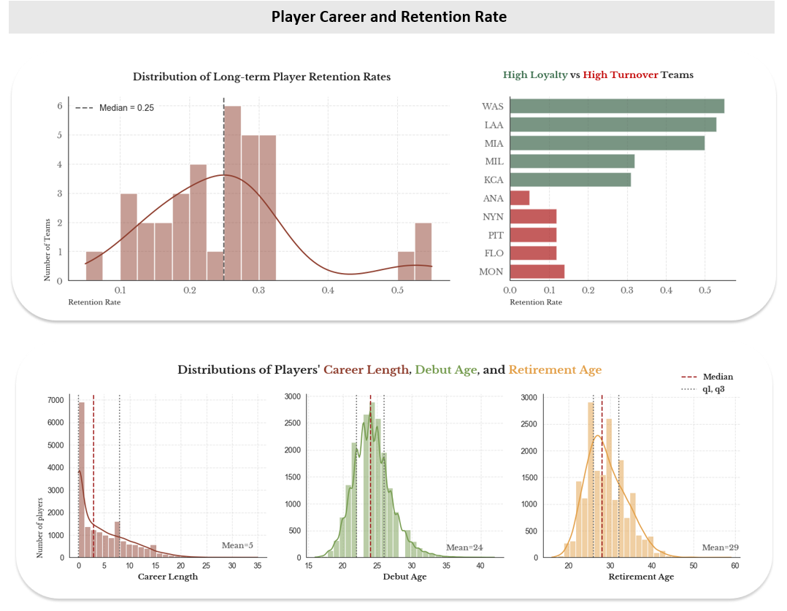
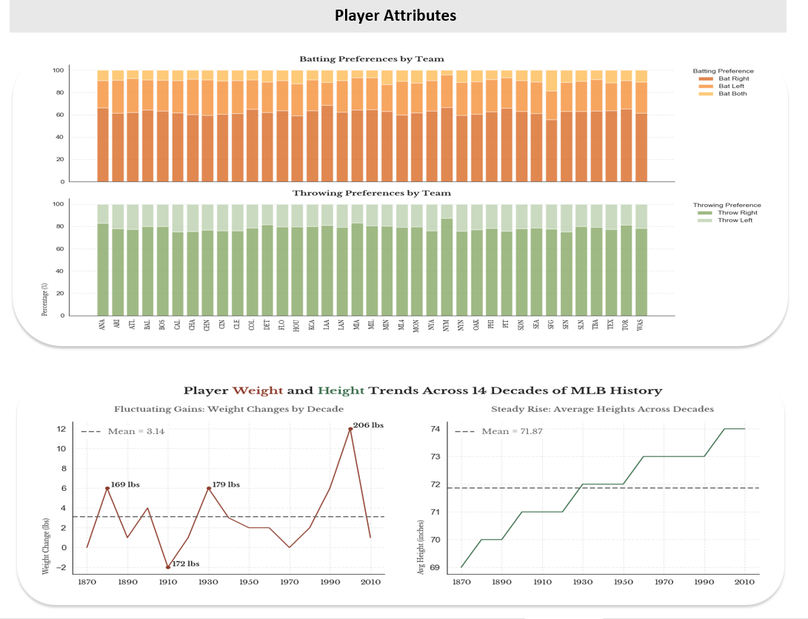

<h1 align="center">The Evolution of Major League Baseball: Told Through Its Players</h1>

## Project Highlights

- **1,000+ schools analyzed** for MLB player production  
- **Over 18,000 player records** examined across decades  
- **Financial spending trends** traced across major franchises  
- **Career length, retention, and player characteristics** revealed using descriptive statistics and advanced SQL queries  
- **Engaging and insightful visuals** created in Jupyter Notebooks for storytelling


## Tools & Libraries

- **Python**, **Pandas**, **NumPy**
- **Matplotlib**, **Seaborn**, **Plotly**
- **Jupyter Notebooks** for analysis and storytelling
- **PostgreSQL** (for original queries and joins)

## Project Structure

```
├── Data/
|   └── Initial Data Load Script/
|       └── mlba_db_create_statements.sql
│   ├── players.csv
│   ├── salaries.csv
│   ├── schools.csv
│   └── school_details.csv
├── Notebook/
│   └── mlb_player_report.ipynb
├── Queries/
│   └── [All SQL files with queries]
├── Visuals/
├── requirements.txt 
├── README.md
└── mlb_player_report.pdf
```

## Key Insights

### 1. **School Origins**
- **California** dominates with 1,247 MLB players, which is more than Texas and Florida combined.
- **UT Austin, USC, and ASU** are top talent pipelines with decades of player output.
- **Shift over time**: From Ivy League in early years to Southern and Western schools in modern decades.
- Post-1990s, **fewer schools feed more players**, suggesting recruitment has become more centralized.



### 2. **Team Behavior & Spending**
- **San Francisco Giants**, **Yankees**, and **Angels** top the lifetime spending chart.
- **2007 saw 6 teams exceed $1B** in total spend, representing the peak of modern team investment strategies.
- **Retention varies sharply**: Some teams retain over 50% of players; others retain just 5%.
- Spending patterns reveal how each team builds competitive strategies differently.



### 3. **Player Career Patterns and Retention Rates**
- **Average career lasts ~3 years** with most players retiring by age 29.
- **75% of players play 8 years or less** and nearly 7,000 last for only a single season.
- Only **23% of long-term players** stay with the team they debuted with.



### 4. **Physical Evolution and Attribute Comparison**
- **Player height** has increased gradually (average rate: 0.35 in/decade).
- **Player weight** increased more rapidly, from 163 lbs in the 1870s to 207 lbs in the 2010s.
- **Batting & throwing styles** remain stable with ~79% of players showing a right-handed throw preference.



##  How to Run and View Project Locally

1. Clone the repository:  
   `git clone https://github.com/shree131/mlb-player-analytics.git`

2. Navigate into the directory:  
   `cd mlb-player-analytics`

3. Install dependencies:  
   `pip install -r requirements.txt`

4. Launch Jupyter Notebook:  
   `jupyter notebook`

*Note: This project uses a .env file to store database credentials. Please create your own .env file based on the structure in the notebook.*

## Summary

Beneath the stats lies a dynamic story of how geography, economics, and strategy have shaped the modern MLB. It's a story told through **data**, **trends**, and **generational shifts** in the league's ecosystem.

---
*© 2024 All rights are reserved.*
